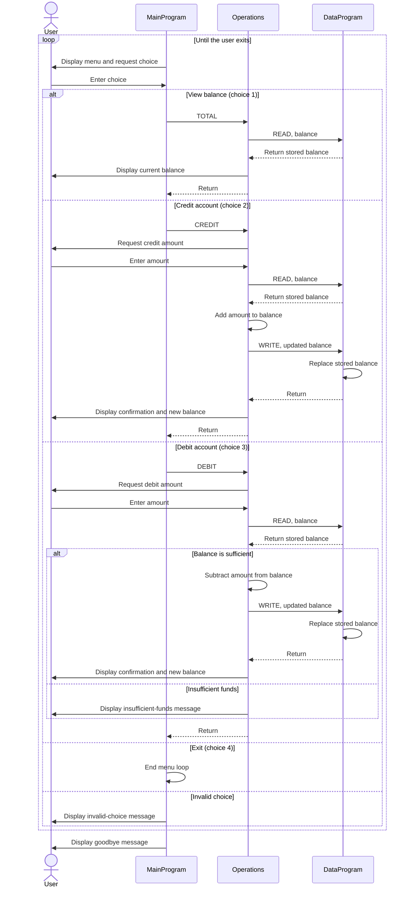

# Student Account Management System

This directory documents the COBOL account-management example in `src/cobol/`.

## COBOL Programs

### `main.cob`

Entry point and interactive menu. It repeatedly displays options to view the balance, credit the account, debit the account, or exit. Choices 1 through 3 are dispatched to `Operations` with operation codes `TOTAL`, `CREDIT`, and `DEBIT`; choice 4 ends the loop. Other choices display an invalid-choice message.

### `operations.cob`

Handles the requested account operation:

- `TOTAL`: reads the balance from `DataProgram` and displays it.
- `CREDIT`: prompts for an amount, reads the balance, adds the amount, writes the updated balance, and displays it.
- `DEBIT`: prompts for an amount, reads the balance, and subtracts and saves it only when the balance is at least the requested amount. Otherwise, it reports insufficient funds.

### `data.cob`

Owns the balance storage and responds to `READ` and `WRITE` requests. `READ` copies the stored balance to the caller; `WRITE` replaces the stored balance with the caller's value. The balance is initialized to `1000.00` when the program storage is initialized.

## Student Account Rules and Current Limitations

- The example maintains a single balance, not separate accounts for individual students. There are no student identifiers or student records in these programs.
- The starting balance is `1000.00`.
- A debit succeeds only if its amount is no greater than the current balance. A failed debit leaves the balance unchanged.
- A credit adds the entered amount to the balance. The code does not enforce a credit limit or other account ceiling.
- Amounts use unsigned numeric fields with two implied decimal places (`PIC 9(6)V99`). The programs do not explicitly validate entered amounts, reject zero, or handle negative transactions.
- The balance is held in program storage; these files do not implement durable file or database persistence.

## Application Data Flow

